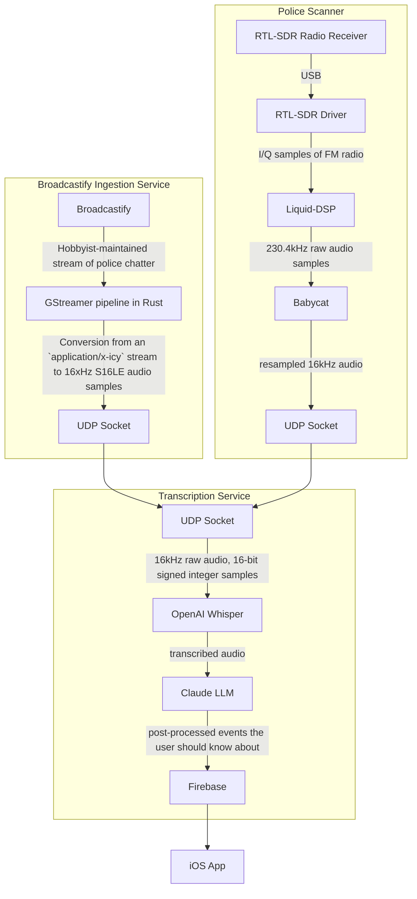

SafeShot — Your Ear to Safety

> **Real-time safety alerts straight from police dispatch, no delays, no noise.**  
> Stay informed. Stay safe. Stay ahead.

 
[Initial demo video](https://youtu.be/L3vK4psVw1M) | 

We tuned the antenna to the same frequency as these NERF handheld walkie-talkies for testing :)

## 🚨 What is SafeShot?

**SafeShot** is an intelligent emergency awareness system that listens directly to **police radio transmissions**, transcribes them instantly, extracts actionable location-specific information, and notifies users nearby — all **in real time**. 

In high-stakes emergencies like active shooter situations, fires, or accidents, **seconds matter**. Social media and apps like Citizen are often delayed or incomplete. SafeShot ensures you get **verified, real-time alerts**, so you can make the safest decision faster.

---

## 💡 Inspiration

One of our teammates unknowingly walked into a mall that was on lockdown due to an active shooter. Although 911 had been called minutes earlier, **no alerts** appeared on Citizen or Twitter. We realized how vital **direct, timely information** from police dispatch could be — and SafeShot was born.

We chose to build our **own hardware radio receiver** because:
- **Ultra low latency** (faster = safer)
- **Higher reliability** (no dependence on hobbyist streams)
- **More control** (plus, it’s fun to hack radios!)
With HearShot, we listen in on police dispatch radio transmissions and transcribe them into concise alerts to ensure that everyone is always aware of any potential safety threats nearby. 

This is our first ever hardware hack! We wanted to build a receiver on our own because:
* low-latency is the priority **(as faster = safer)**,and the online streams add extra latency on top of degrading quality
* the online streams are quite unreliable and go down often (maintained by hobbyists)
* it’s more fun :) 

## What it does
Hearshot listens to police radios to learn about incidents in real time and uses this information to notify users in the area. Users can see a transcription of the radio chatter to learn about what and where the event is. This helps people avoid dangerous incidents in realtime, without relying on user-generated content. In an emergency, safety is the priority; information from social media apps may not always be an option.

---
# How we built it

Because we intend on hosting this project for more than just this hackathon, this project had to be built with a very, very low monthly cost. Thus, **we deployed to our own self-hosted hardware**, as renting GPUs in this market is far too expensive for our broke college wallets. 

## Hardware
**Radio Receiver (Raspberry Pi 4 4gb)**
* RTL SDR driver
* Liquid-DSP for FM demodulation
* Babycat for resampling + making the audio louder
* Send raw audio data to the transcriber via UDP

## Backend
**Broadcastify receiver** 
* This was a backup plan in case the radio fell through, but **we managed to make the receiver work** in the end. There’s still a lot of tuning and DSP work to make it work really well, but speech does come through.

**A small GStreamer** - This was used to read from an online MPEG stream of police radios, decode the data into raw audio samples, and forward them over UD.

**Transcription Pipeline** - Hosted on our own physical server rack at UMN with a 3080 and a 1080 for accelerated ML pipelines.
* |> Read raw audio samples over a UDP socket
* |> Feed them into a modified WhisperAI – whisper does NOT support live transcription, we built our own layer on top of Whisper to do live transcription directly from data samples
* |> We use Claude to identify locations in plain english, and then, with context, ping the Places API to get the exact coordinates for a relative location
	* For example, this pipeline accurately locates human-readable places like “McDonalds on 4th” or “West and Grange” or even just “Pauley” 
* |> Further extract and format, and read transcripts into Firestore. 
* |> Identify “events” and associate chatter – on every new event, ping the NodeJS backend.

**NodeJS Messaging Server** - Hosted on the aforementioned physical server rack, but on a much lower-end vps.
* Hosts endpoints for keeping track of FCM tokens, and subscribes each to the relevant location-based alerts. 
* Sends out push notifications when new events with “high” severity, or “fire” if it’s very close. 

## Frontend – React Native
* We developed our frontend using React Native, creating custom components along the way (alerts, transcription, notifications, etc.). 
* For authentication, we used phone numbers as login with Firebase Auth. Our very neat maps are implemented using custom styling on Google Maps. 
* We spent many many hours designing! Shoutout to our mentor Michael for teaching me many many Figma hotkeys and tricks. 

## Challenges we ran into

We had never touched radio before, and we didn't realize how low-quality radio signals actually were. Making any model work on such low quality audio was a HUGE challenge, not to mention the added challenge of doing it in real time. 
We also were trying to get GPUs in the cloud to practice (before we condensed it down to fit on a 3080) and we lost bids for on-demand pricing many times :)

## Accomplishments that we're proud of

Everything worked! We cut it really close but our whole pipeline was functional, and alerts were being sent out. 

## What's next for Hearshot

We're planning on tuning the antenna to the dispatch for the Minneapolis region and then publishing the app for the surrounding metro area first, and then rolling out two more antenna over the next few weeks.

